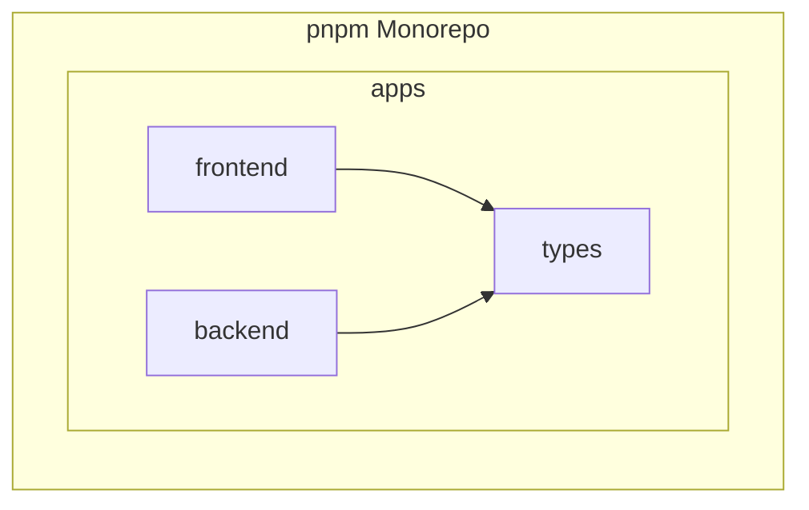
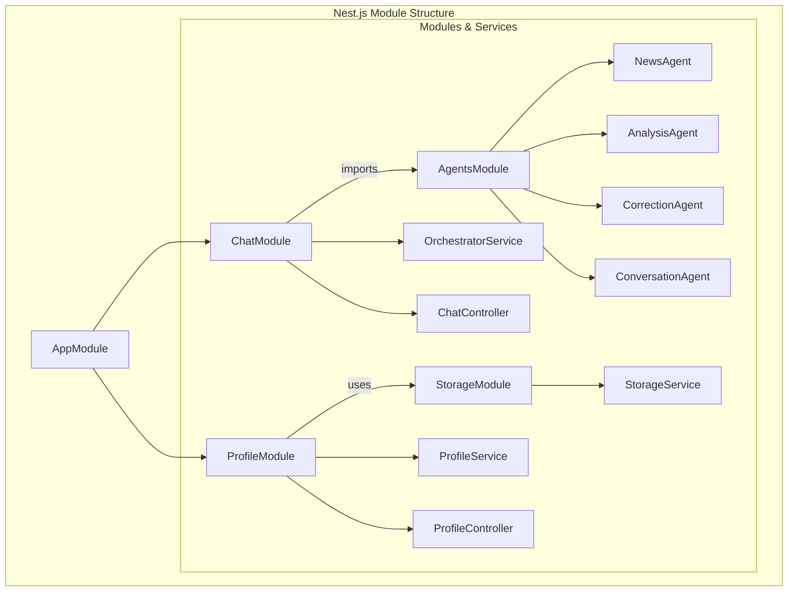
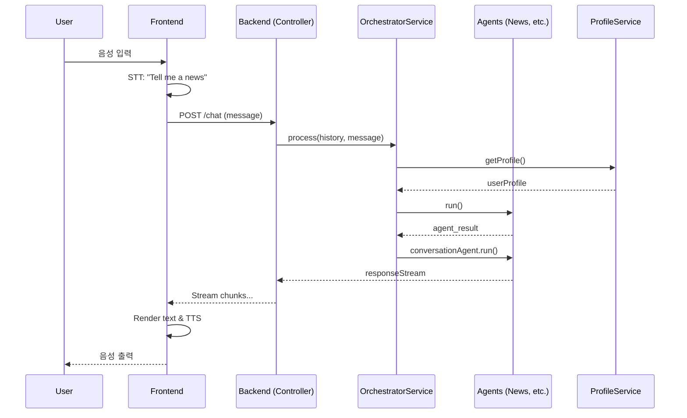

# AI 영어 회화 서비스 아키텍처 설계

## 1. 시스템 구조 개요

본 시스템은 프론트엔드(Next.js)와 백엔드(Nest.js)가 분리된 모노레포 구조를 채택하여, 확장성과 유지보수성을 극대화합니다.

### 1.1. 전체 시스템 구조도

```mermaid
graph TD
    subgraph "Frontend (Next.js)"
        UI[UI Components]
        State[State Management]
        Speech[Web Speech API<br/>(STT/TTS)]
    end

    subgraph "Backend (Nest.js)"
        Controller[API Controllers]
        subgraph "AI Agent Network"
            Orchestrator[OrchestratorService]
            News[NewsAgent]
            Analysis[AnalysisAgent]
            Correction[CorrectionAgent]
            Conversation[ConversationAgent]
        end
        ProfileService[ProfileService]
        Storage[(user_profile.json)]
    end

    UI --> Controller
    Controller -- /chat --> Orchestrator
    Controller -- /profile --> ProfileService
    Orchestrator --> News & Analysis & Correction & Conversation
    Orchestrator --> ProfileService
    ProfileService --> Storage

```

### 1.2. 모노레포 구조



## 2. 컴포넌트 상세 설명

### 2.1. 프론트엔드 (Next.js)

- **UI Components**: React 기반의 사용자 인터페이스
  - 대화 히스토리 표시 (`ChatMessage.tsx`)
  - 메시지 입력 및 전송 (`ChatInput.tsx`)
- **Speech Handling (`useSpeech.ts` Hook)**:
  - Web Speech API를 활용한 음성-텍스트 변환(STT) 및 텍스트-음성 변환(TTS) 처리
- **API Communication**:
  - 백엔드 `/chat` API와 통신하여 응답 스트림을 실시간으로 렌더링

### 2.2. 백엔드 (Nest.js)



- **모듈 구성**:
  - `AppModule`: 애플리케이션의 루트 모듈.
  - `ChatModule`: `/chat` 엔드포인트를 통해 대화 흐름을 관리. `OrchestratorService`를 포함.
  - `AgentsModule`: 각 AI 에이전트(`NewsAgent`, `ConversationAgent` 등)를 프로바이더로 제공.
  - `ProfileModule`: `/profile` 엔드포인트를 통해 사용자 프로필을 관리.
  - `StorageModule`: `user_profile.json` 파일에 대한 읽기/쓰기 로직을 담당하는 `StorageService` 제공.

### 2.3. 공유 타입 시스템

```typescript
// apps/types/src/index.ts

export interface ChatMessage {
  sender: "user" | "assistant" | "system";
  timestamp: string;
  text: string;
  correction?: Correction;
}

export interface UserProfile {
  name: string;
  interests: string[];
  learningLevel: string;
  recentCorrections: CorrectionWithErrors[];
}

// ... and other shared types like Correction, NewsAnalysis, etc.
```

## 3. 데이터 흐름



## 4. 확장성 고려사항

### 4.1. 데이터베이스 확장

- **초기 단계**: 로컬 `user_profile.json` 파일 사용 (`StorageService`).
- **확장 단계**:
  - **사용자 데이터**: `StorageService`의 내부 구현을 PostgreSQL/MySQL 같은 관계형 데이터베이스로 교체.
  - **기억 저장소**: 대화 기록이나 문서 임베딩을 저장하기 위해 별도의 벡터 데이터베이스(e.g., ChromaDB, LanceDB) 도입 고려.

### 4.2. 보안 고려사항

- **환경 변수**: API 키(Gemini, Tavily)는 `.env` 파일로 관리하고 `ConfigModule`을 통해 주입.
- **API 보안**: 현재는 별도 인증 없으나, 향후 JWT 등을 이용한 사용자 인증 체계 도입 가능.
- **데이터 처리**: 민감한 사용자 데이터는 전송 및 저장 시 암호화 고려.
