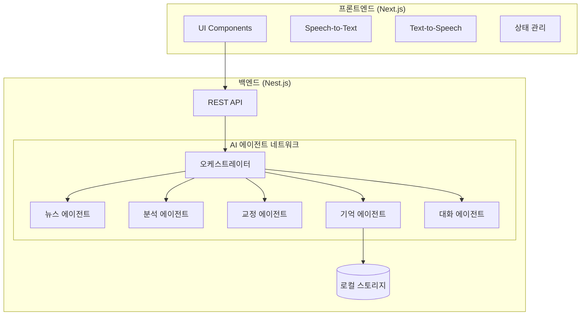
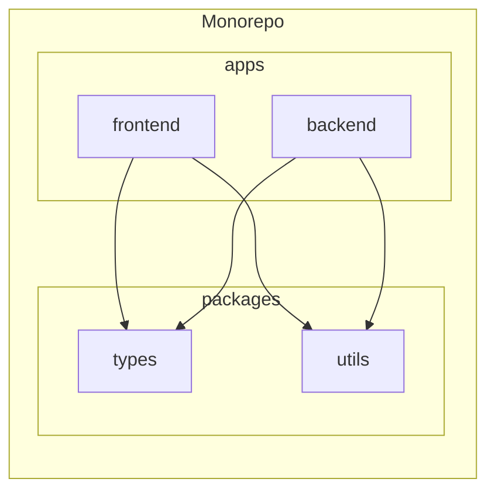
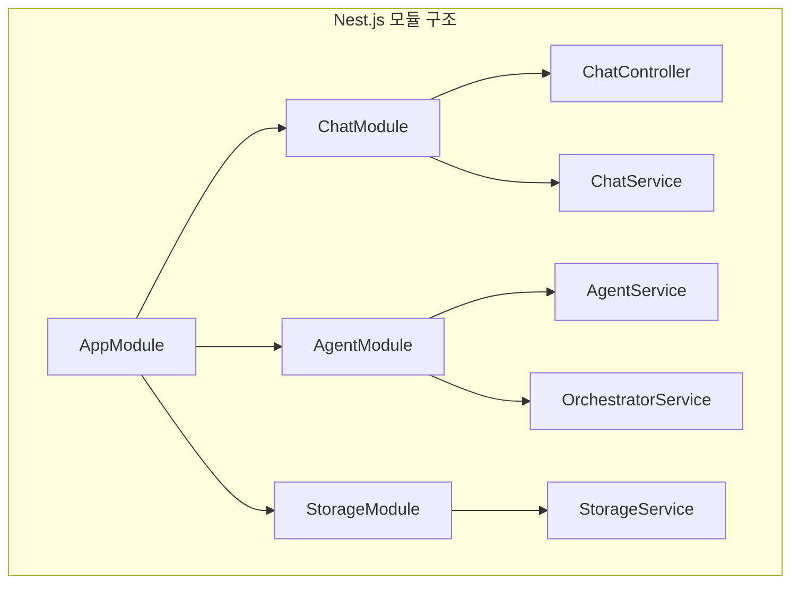
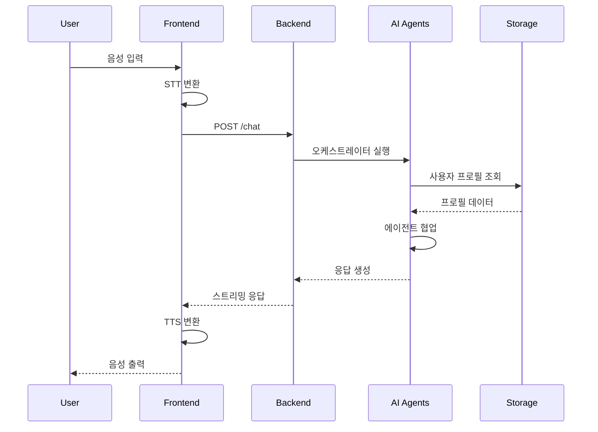
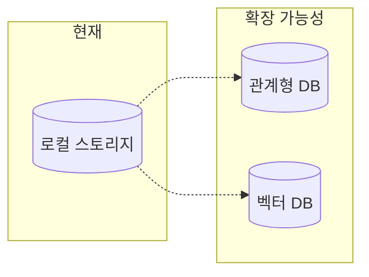

# AI 영어 회화 서비스 아키텍처 설계

## 1. 시스템 구조 개요

본 시스템은 프론트엔드(Next.js)와 백엔드(Nest.js)가 분리된 모노레포 구조를 채택하여, 확장성과 유지보수성을 극대화합니다.

### 1.1. 전체 시스템 구조도



### 1.2. 모노레포 구조



## 2. 컴포넌트 상세 설명

### 2.1. 프론트엔드 (Next.js)

- **UI Components**: React 기반의 사용자 인터페이스
  - 대화 히스토리 표시
  - 음성 입력/출력 상태 표시
  - 실시간 피드백 UI
- **Speech Handling**:
  - Web Speech API를 활용한 STT/TTS 처리
  - 음성 스트림 관리

### 2.2. 백엔드 (Nest.js)



- **모듈 구성**:
  - `ChatModule`: 대화 처리 및 스트리밍
  - `AgentModule`: AI 에이전트 네트워크 관리
  - `StorageModule`: 로컬 저장소 관리

### 2.3. 공유 타입 시스템

```typescript
// packages/types/src/chat.ts 예시
export interface ChatMessage {
  role: "user" | "assistant";
  content: string;
  timestamp: string;
}

export interface UserProfile {
  userName: string;
  interests: string[];
  learningLevel: "Beginner" | "Intermediate" | "Advanced";
  recentCorrections: CorrectionHistory[];
}
```

## 3. 데이터 흐름



## 4. 확장성 고려사항

### 4.1. 데이터베이스 확장



- **초기 단계**: 로컬 JSON 파일 사용
- **확장 단계**:
  - 사용자 데이터: PostgreSQL/MySQL
  - 벡터 저장소: ChromaDB/LanceDB

### 4.2. 보안 고려사항

- 환경 변수 관리
- API 키 보안
- 사용자 데이터 암호화
