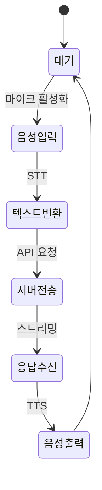
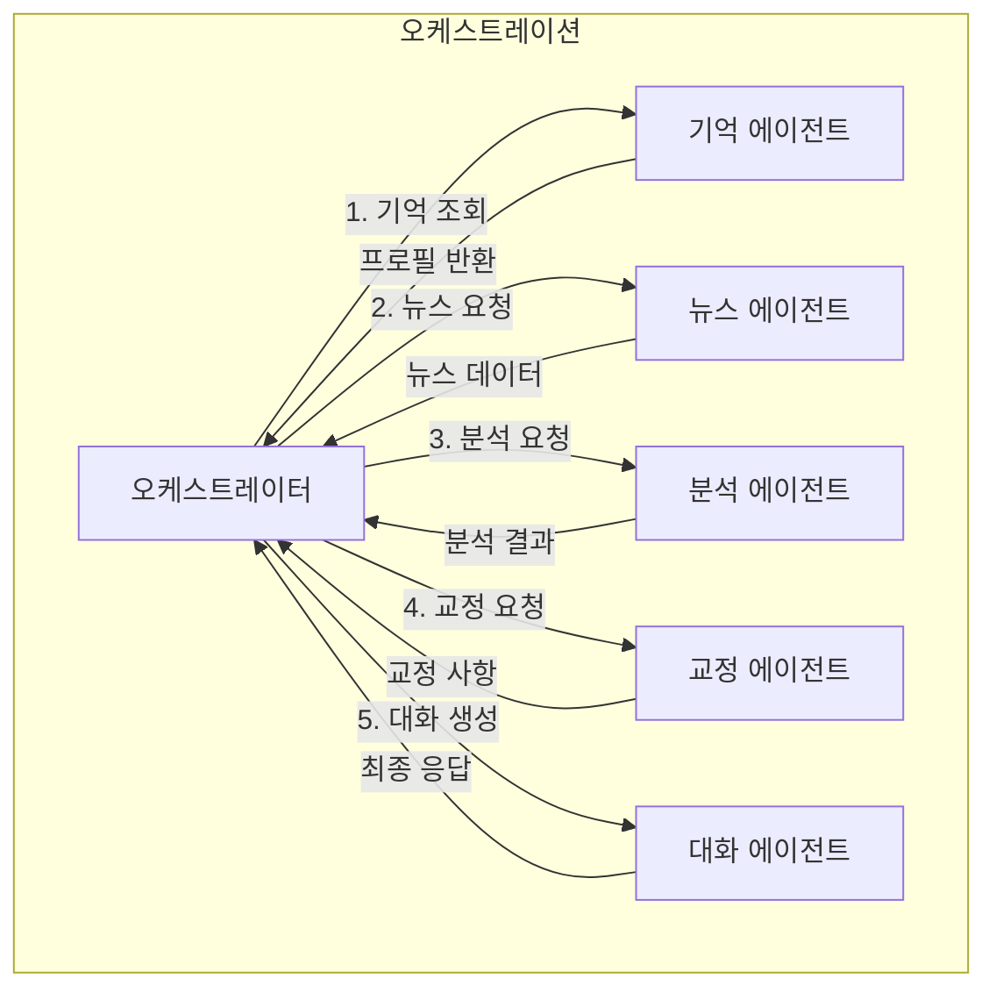
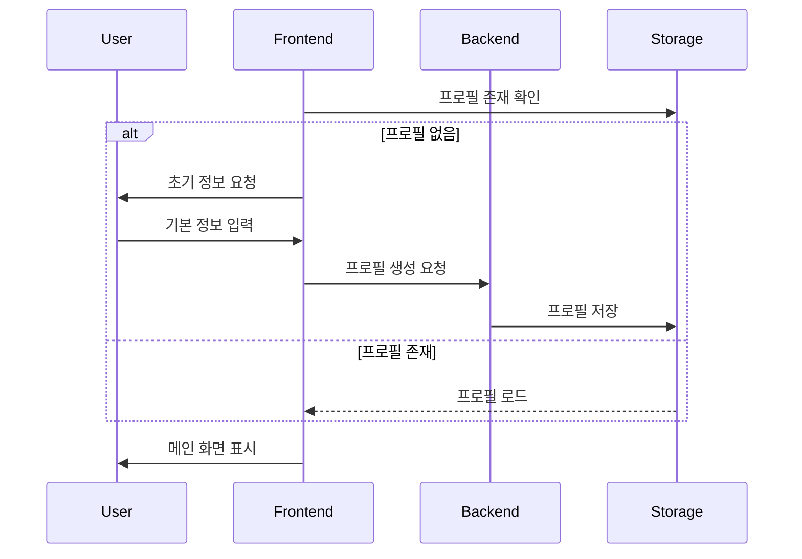
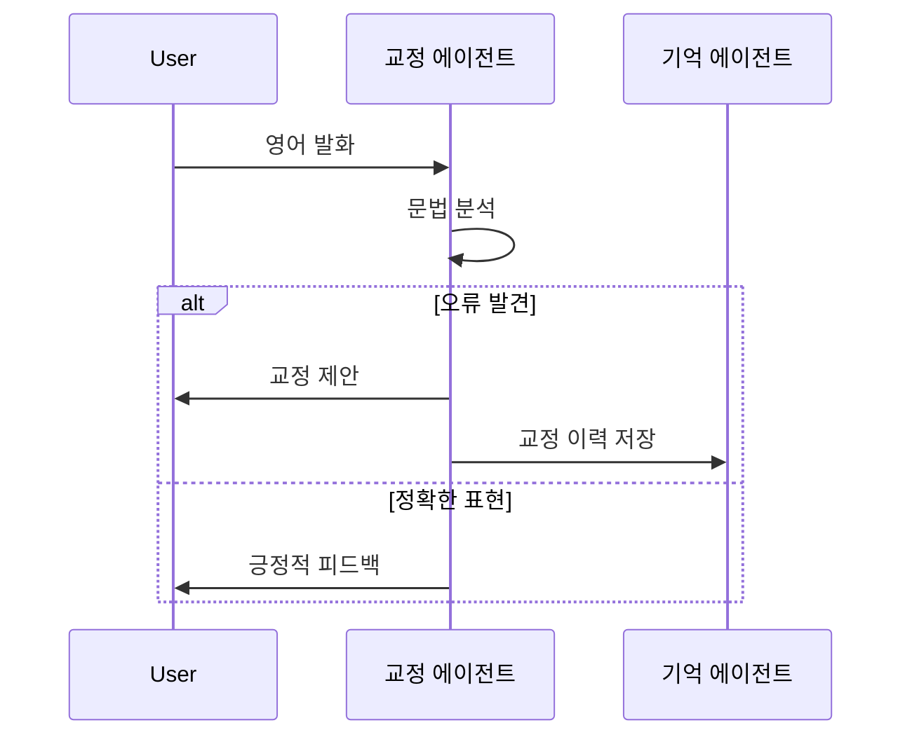
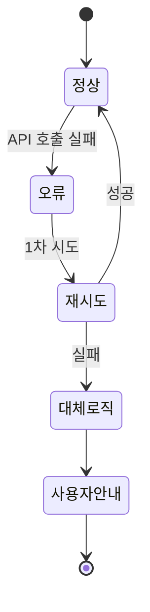
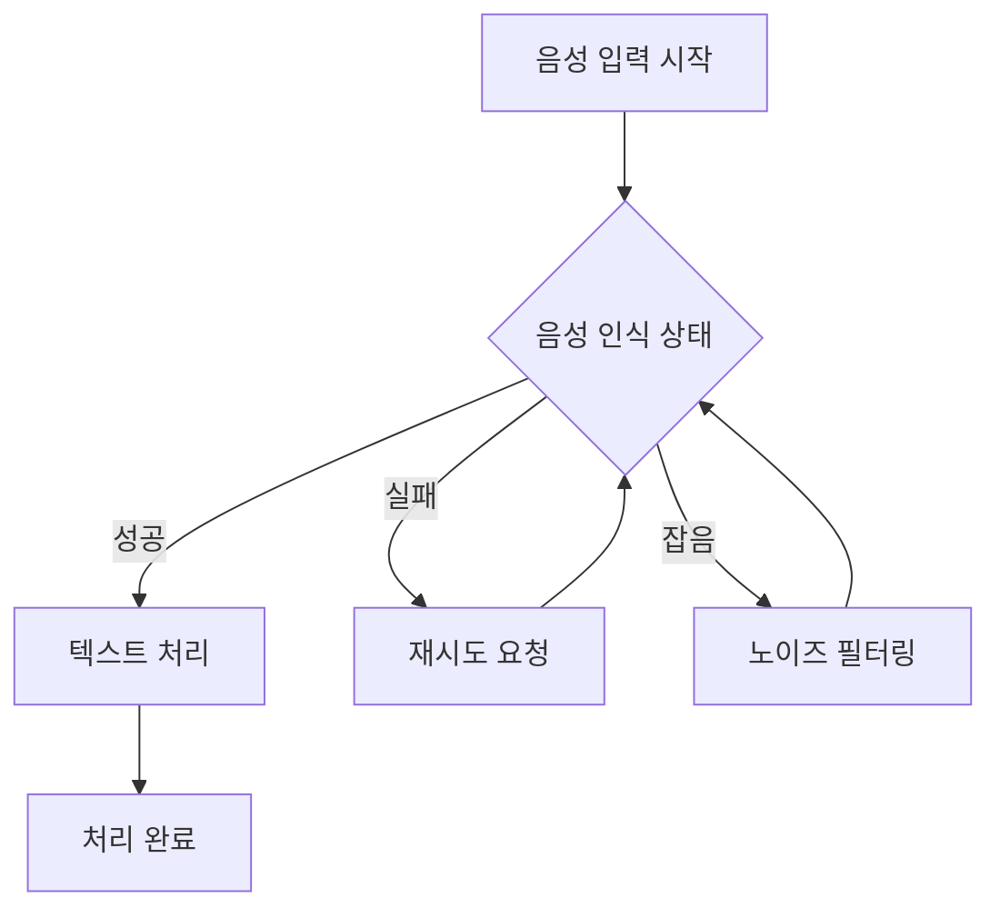
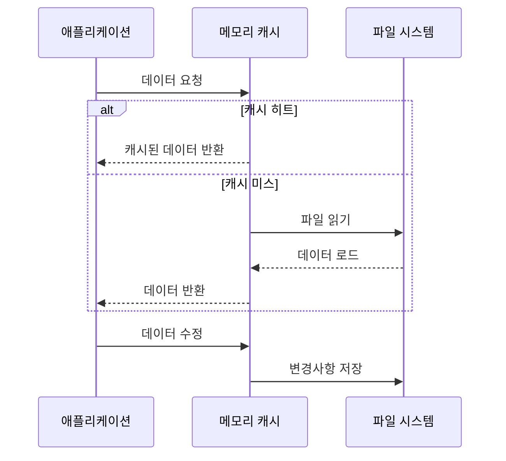
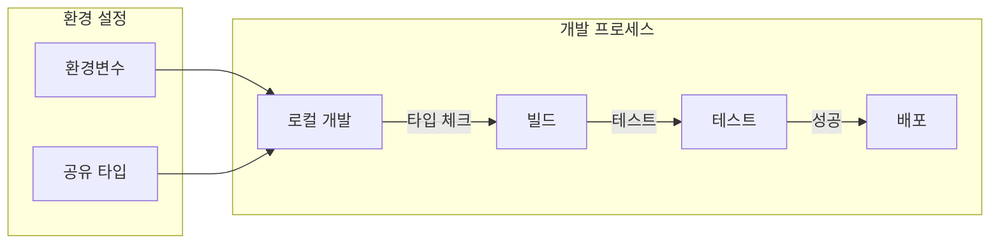

# AI 영어 회화 서비스 워크플로우

## 1. 사용자 상호작용 흐름

### 1.1. 기본 대화 흐름

### 1.2. 에이전트 협업 프로세스

## 2. 주요 프로세스 상세

### 2.1. 최초 실행 및 프로필 생성

### 2.2. 문법 교정 및 피드백

## 3. 에러 처리 워크플로우

### 3.1. API 오류 복구

### 3.2. 음성 인식 오류 처리

## 4. 데이터 동기화 프로세스

### 4.1. 로컬 스토리지 관리

## 5. 개발 워크플로우

### 5.1. 모노레포 개발 프로세스

### 5.2. 테스트 프로세스

- 단위 테스트: 각 에이전트의 독립적 기능
- 통합 테스트: 에이전트 간 협업
- E2E 테스트: 전체 사용자 시나리오
