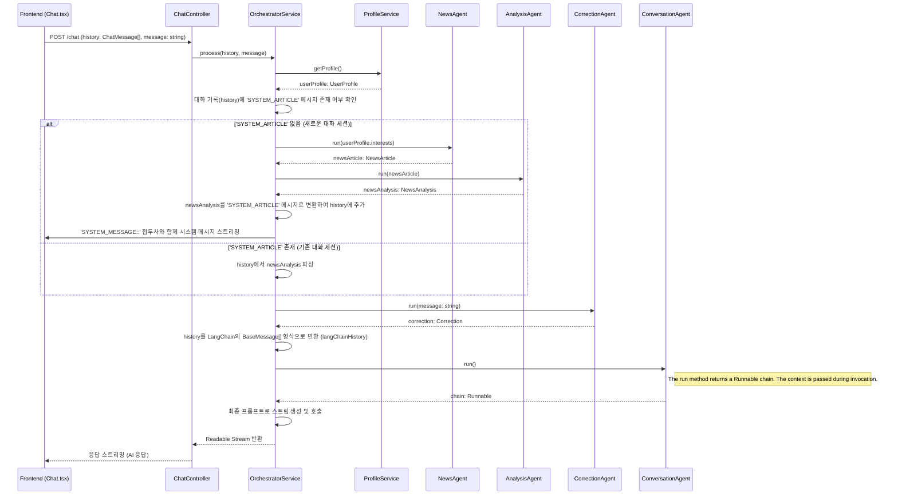

# AI 영어 회화 서비스 워크플로우 (v2 - 2024-06-25)

## 1. 개요

본 문서는 AI 영어 회화 서비스의 전체적인 아키텍처, 데이터 흐름, 에이전트 협업 방식을 상세히 기술합니다. 시스템은 사용자의 채팅 입력을 받아 여러 전문 에이전트(Agent)를 통해 분석, 교정, 정보 제공을 수행하고, 최종적으로 자연스러운 영어 대화 응답을 생성합니다.

---

## 2. 전체 아키텍처 및 데이터 흐름

### 2.1. 핵심 컴포넌트

- **Frontend**: Next.js 기반의 사용자 인터페이스. 사용자의 입력을 받고, 스트리밍 응답을 처리하여 화면에 표시.
- **Backend**: NestJS 기반의 서버. API 엔드포인트를 제공하고, 전체 에이전트 시스템을 조율.
  - `ChatController`: `/chat` 엔드포인트. 프론트엔드로부터 요청을 받아 `OrchestratorService`에 전달.
  - `OrchestratorService`: 시스템의 핵심 두뇌. 각 에이전트의 실행 순서와 데이터 흐름을 관리.
- **Agents**: 특정 작업을 수행하는 독립적인 모듈. LangChain 프레임워크를 기반으로 구현.

### 2.2. 메인 워크플로우 다이어그램



---

## 3. 채팅 세션 관리 (Article-based Conversation)

본 서비스는 대화의 일관성과 깊이를 더하기 위해, **새로운 대화 세션의 첫 번째 메시지에 한해서만 관련 뉴스 기사를 가져옵니다.** 이후의 대화는 해당 기사를 기반으로 진행됩니다.

1.  **세션 식별**: `OrchestratorService`는 프론트엔드에서 받은 대화 기록(`history: ChatMessage[]`) 내에 특정 접두사(`SYSTEM_ARTICLE:`)를 가진 `system` 역할의 메시지가 있는지 확인합니다.
2.  **신규 세션 (메시지 없음)**
    - `NewsAgent`와 `AnalysisAgent`를 순차적으로 호출하여 `NewsAnalysis` 객체를 생성합니다.
    - 이 `NewsAnalysis` 객체를 JSON 문자열로 변환하고, 접두사를 붙여 `ChatMessage` 객체(`sender: 'system'`)를 만듭니다.
    - 이 시스템 메시지는 **응답 스트림의 가장 앞부분에 특별한 접두사(`SYSTEM_MESSAGE::`)와 함께 프론트엔드로 전송**됩니다.
    - 또한, 이 시스템 메시지는 이후의 에이전트 호출을 위해 백엔드의 대화 기록(`fullHistory`)에도 추가됩니다.
3.  **기존 세션 (메시지 있음)**
    - 대화 기록에 포함된 시스템 메시지에서 `NewsAnalysis` JSON을 파싱하여 사용합니다.
    - `NewsAgent`와 `AnalysisAgent`는 호출되지 않아 API 사용량과 응답 시간을 최적화합니다.
4.  **프론트엔드 처리**: `Chat.tsx`는 `SYSTEM_MESSAGE::` 접두사가 붙은 스트림 데이터를 감지하면, 이를 파싱하여 `messages` 상태에 추가합니다. 이 메시지는 화면에는 렌더링되지 않지만, 다음 서버 요청 시 대화 기록의 일부로 전송되어 세션을 유지하는 역할을 합니다.

---

## 4. 에이전트 상세 명세

### 4.1. `NewsAgent`

- **역할**: 사용자의 관심사에 맞는 최신 뉴스 기사를 검색합니다.
- **입력**: `interests: string[]` (사용자 프로필에서 가져온 관심사 배열)
- **출력**: `Promise<NewsArticle>`
- **사용 도구**: `@langchain/community/tools/tavily_search`
- **핵심 로직**:
  1.  `TavilySearchResults` 도구를 초기화합니다. (`TAVILY_API_KEY` 필요)
  2.  입력받은 관심사를 기반으로 검색 쿼리를 생성합니다.
  3.  Tavily API를 호출하고, 검색 결과가 없으면 기본 아티클을 반환합니다.
  4.  결과의 `content`를 `fullText`로 사용하여 `NewsArticle` 객체를 반환합니다.
  5.  API 응답(`searchResultsString`)은 JSON 문자열이므로 `JSON.parse()`로 파싱하여 사용합니다.

### 4.2. `AnalysisAgent`

- **역할**: 뉴스 기사를 분석하여 영어 학습에 유용한 요약, 단어, 질문을 생성합니다.
- **입력**: `article: NewsArticle`
- **출력**: `Promise<NewsAnalysis>`
- **핵심 로직**:
  1.  **Zod 스키마 (`analysisSchema`)**: LLM의 출력 구조를 정의합니다. `summary`, `vocabulary`, `questions` 필드를 포함하며, `vocabulary` 내부의 `example` 필드는 `optional()`로 처리하여 유연성을 확보합니다.
  2.  **파서 (`StructuredOutputParser`)**: Zod 스키마를 기반으로 LLM 출력을 파싱할 파서를 생성합니다.
  3.  **자동 복구 파서 (`OutputFixingParser`)**: LLM 출력이 JSON 형식을 벗어나는 등 파싱에 실패할 경우, LLM을 다시 호출하여 출력을 스스로 교정하도록 시도합니다. 이는 시스템의 견고성을 크게 향상시킵니다.
  4.  **최종 안전 장치**: `OutputFixingParser`조차 실패할 경우를 대비해 `try...catch` 블록으로 전체를 감싸고, 사전에 정의된 대체 `NewsAnalysis` 객체를 반환하여 서비스 중단을 방지합니다.

#### `AnalysisAgent`의 에러 처리 워크플로우

```mermaid
graph TD
    A[AnalysisAgent.run(article)] --> B{LLM 호출};
    B --> C{LLM 응답 수신};
    C --> D{OutputFixingParser 시도};
    D -->|파싱 성공| E[NewsAnalysis 반환];
    D -->|파싱 실패| F{LLM에 자동 교정 요청};
    F -->|교정 성공| D;
    F -->|교정 실패| G[try...catch 블록];
    G --> H[대체 NewsAnalysis 객체 반환];
    E --> Z[정상 종료];
    H --> Z;
```

### 4.3. `CorrectionAgent`

- **역할**: 사용자의 마지막 발화에 대한 문법적 오류를 분석하고 교정안을 제시합니다.
- **입력**: `userMessage: string` (사용자의 마지막 메시지 텍스트)
- **출력**: `Promise<Correction>`
- **핵심 로직**:
  1.  **Zod 스키마 (`correctionSchema`)**: 교정 결과의 구조(`has_errors`, `original`, `corrected`, `explanation` 등)를 정의합니다.
  2.  `PromptTemplate`을 사용하여 LLM에게 영어 교사의 역할을 부여하고, `userMessage`를 분석하도록 요청합니다.
  3.  LLM의 출력을 `StructuredOutputParser`로 파싱하여 `Correction` 객체를 반환합니다.

### 4.4. `ConversationAgent`

- **역할**: 모든 컨텍스트(사용자 정보, 뉴스 분석, 문법 교정, 대화 기록)를 종합하여 최종적인 AI 응답을 생성합니다.
- **입력**: `{ userProfile, newsAnalysis, correction, chatHistory: BaseMessage[] }`
- **출력**: `Promise<Runnable<any, any>>` (스트리밍 가능한 LangChain 객체)
- **핵심 로직**:
  1.  `OrchestratorService`로부터 앱의 `ChatMessage[]`가 아닌, LangChain이 이해할 수 있는 `BaseMessage[]` 형식의 대화 기록을 받습니다.
  2.  `ChatPromptTemplate`과 `MessagesPlaceholder`를 사용하여 시스템 프롬프트, 이전 대화 기록, 그리고 다양한 컨텍스트 정보를 조합한 최종 프롬프트를 구성합니다.
  3.  LLM에 연결된 `Runnable` 체인을 구성하여 반환합니다. 이 체인은 `OrchestratorService`에서 스트리밍 방식으로 실행됩니다.

---

## 5. 핵심 데이터 타입 (`apps/types/src/index.ts`)

```typescript
// 사용자, AI, 시스템 메시지를 구분하는 채팅 메시지 기본 구조
export interface ChatMessage {
  sender: "user" | "assistant" | "system";
  timestamp: string;
  text: string;
  correction?: Correction;
  isError?: boolean;
}

// NewsAgent가 반환하는 기사 형식
export interface NewsArticle {
  title: string;
  source: string;
  url: string;
  fullText: string;
}

// AnalysisAgent가 반환하는 기사 분석 결과
export interface NewsAnalysis {
  summary: string;
  vocabulary: {
    word: string;
    definition: string;
    example?: string;
  }[];
  questions: string[];
}

// CorrectionAgent가 반환하는 교정 결과 타입
export interface CorrectionWithErrors {
  has_errors: true;
  original: string;
  corrected: string;
  explanation: string;
}

export interface CorrectionNoErrors {
  has_errors: false;
  feedback: string;
}

export type Correction = CorrectionWithErrors | CorrectionNoErrors;

// 사용자 프로필 정보
export interface UserProfile {
  name: string;
  interests: string[];
  learningLevel: string;
  recentCorrections: CorrectionWithErrors[];
}
```
